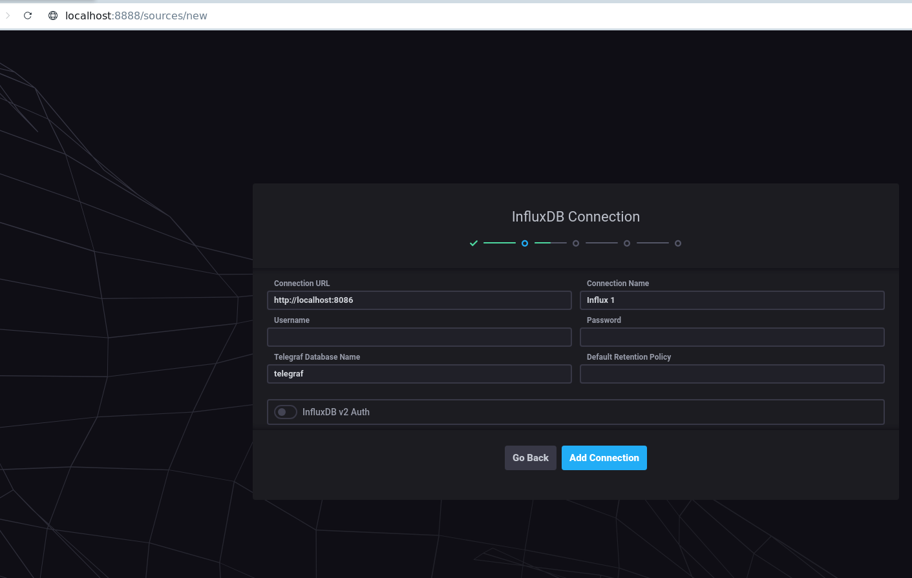
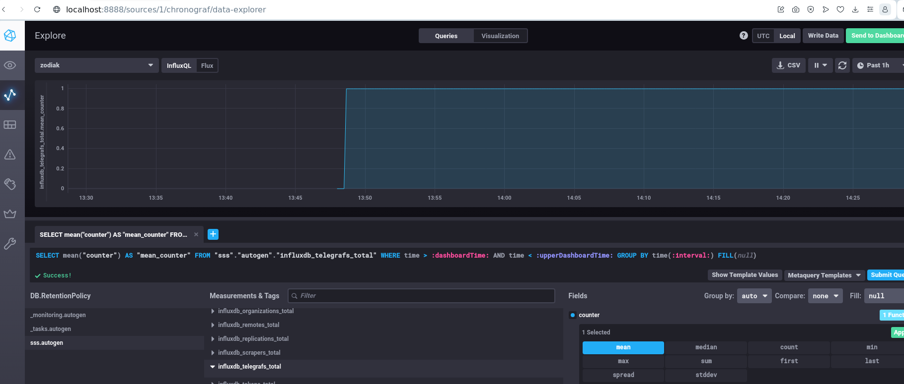

## Домашнее задание к занятию "13.Системы мониторинга"

## Обязательные задания

## 1.       

Очевидно так как в задании четко дано понять: *нагрузка ЦПУ-* будем отслеживать загрузку процессора, заетм - *память*- для отслеживания эффективного использования ресурсов системы, *доступность сервиса* - это позволит отслеживать доступность сервиса у пользователей в режиме реального времени, *хранилище отчетов*- это даст нам понятие что результаты вычислений успешно сохраняются, *Трафик HTTP*- отслеживать метрики  HTTP - трафика, т к в задании это прямо указано, ну и логии ошибки. 

## 2.       
   Для понимания выполнения обязанностей перед клиентами и качеством обслуживания могут применяться след. метрики:
Время отклика
Доступность
Количество запросов
Время восстановления
Уровень удовлетворенности клиентов
## 3   
Это плохо. Как вариан использовать журналы ошибок внутри их приложений. Так же настроить уведомления.Так же можно создать отдельный сервер и собирать на нем ошибки со всех приложений. Для последующего анализа. Ну и мониторить ошибки с помощью самих рахработчиков, думаю им будет проще настроить логирование в своих приложениях. 
## 4
Ну тут судя по всему вычесление идет по формуле которая делит кол-во успешных запросов на общее кол-во. Скорее всего это не правильно. Думаю нужно учитывать все коды запроса 3хх 1хх в том числе. Так же возможно не правильно собираются данные или интерпритируются, поэтому ошибка может возникать в самом источнике данных.
## 5 
Плюсы push 
- Мгновенная реакция
- Масштабируемость
- Гибкость настройки
Минусы
- Нагрузка на клиент
- Затраты на инфраструктуру
- Сложность конфигурации
Плюсы pull
- Гибкость сбора данных
- Меньше нагрузка на клиент
- Простота интеграции
Минусы
- Задержка в реакции
- Высокая нагрузка на мониторинговую систему
- Ограничение по распределению 

## 6 
Prometheus - pull (но вроде он может использовать pushgateway для сбора метрик от приложений)
TICK - push по умолчанию, но может и pull если испольовать telegraf
zabbix  - push основной режим работы.
VictoriaMetrics - поддерживает и push, и pull
Nagios - pull 

## 7 

## 8

## 9

