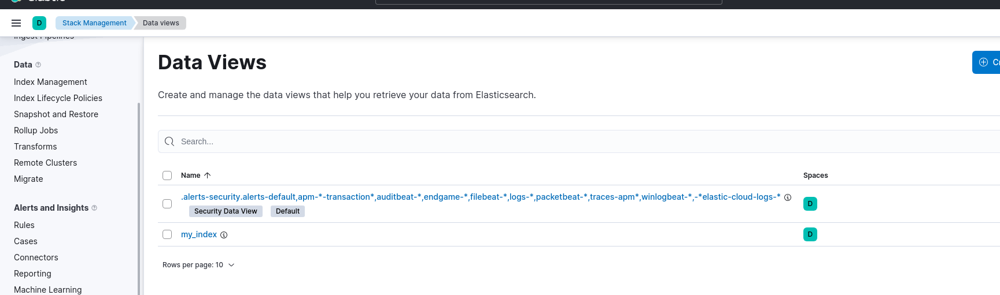

C help

## 1

## 2

Не обратил внимание что директорию можно использовать и делал вначале сам. Во вложении будет ссылка на свой репозиторий. Но были проблемы почему то контейнеры останавливались. Проверял на вашем, помучался но все запустилось. Поменял только на новые версии в yml. 